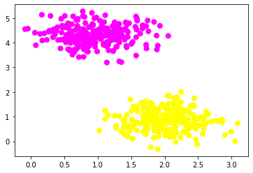
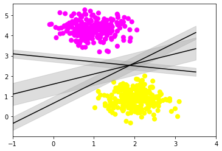
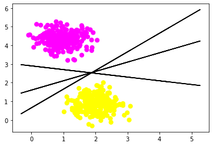

```python
from sklearn.datasets import make_blobs
```


```python
X,Y=make_blobs(n_samples=500,centers=2,random_state=0,cluster_std=0.40)
import matplotlib.pyplot as plt
plt.scatter(X[:,0],X[:,1],c=Y,s=50,cmap='spring')
plt.show()
```





```python
import numpy as np
xfit=np.linspace(-1,3.5)
plt.scatter(X[:,0],X[:,1],c=Y,s=50,cmap='spring')
for m,b,d in [(1,0.65,0.33),(0.5,1.6,0.55),(-0.2,2.9,0.2)]:
    yfit=m*xfit+b
    plt.plot(xfit,yfit,'-k')
    plt.fill_between(xfit,yfit-d,yfit+d,edgecolor='none',color='#AAAAAA',alpha=0.4)
plt.xlim(-1,4,5)
plt.show()

```





```python
import numpy as np
import pandas as pd
import matplotlib.pyplot as plt
```


```python
data=pd.read_csv("diabetes.csv")
```


```python
data.columns
```


    Index(['Glucose', 'BloodPressure', 'SkinThickness', 'Insulin', 'BMI',
           'DiabetesPedigreeFunction', 'Age', 'Outcome'],
          dtype='object')


```python
X=data.iloc[:,0:7]
```


```python
X.head()
```


<div>
<style scoped>
    .dataframe tbody tr th:only-of-type {
        vertical-align: middle;
    }

    .dataframe tbody tr th {
        vertical-align: top;
    }

    .dataframe thead th {
        text-align: right;
    }
</style>
<table border="1" class="dataframe">
  <thead>
    <tr style="text-align: right;">
      <th></th>
      <th>Glucose</th>
      <th>BloodPressure</th>
      <th>SkinThickness</th>
      <th>Insulin</th>
      <th>BMI</th>
      <th>DiabetesPedigreeFunction</th>
      <th>Age</th>
    </tr>
  </thead>
  <tbody>
    <tr>
      <th>0</th>
      <td>148</td>
      <td>72</td>
      <td>35</td>
      <td>0</td>
      <td>33.6</td>
      <td>0.627</td>
      <td>50</td>
    </tr>
    <tr>
      <th>1</th>
      <td>85</td>
      <td>66</td>
      <td>29</td>
      <td>0</td>
      <td>26.6</td>
      <td>0.351</td>
      <td>31</td>
    </tr>
    <tr>
      <th>2</th>
      <td>183</td>
      <td>64</td>
      <td>0</td>
      <td>0</td>
      <td>23.3</td>
      <td>0.672</td>
      <td>32</td>
    </tr>
    <tr>
      <th>3</th>
      <td>89</td>
      <td>66</td>
      <td>23</td>
      <td>94</td>
      <td>28.1</td>
      <td>0.167</td>
      <td>21</td>
    </tr>
    <tr>
      <th>4</th>
      <td>137</td>
      <td>40</td>
      <td>35</td>
      <td>168</td>
      <td>43.1</td>
      <td>2.288</td>
      <td>33</td>
    </tr>
  </tbody>
</table>
</div>


```python
y=data.iloc[:,-1:]
```


```python
y.head()
```


<div>
<style scoped>
    .dataframe tbody tr th:only-of-type {
        vertical-align: middle;
    }

    .dataframe tbody tr th {
        vertical-align: top;
    }

    .dataframe thead th {
        text-align: right;
    }
</style>
<table border="1" class="dataframe">
  <thead>
    <tr style="text-align: right;">
      <th></th>
      <th>Outcome</th>
    </tr>
  </thead>
  <tbody>
    <tr>
      <th>0</th>
      <td>1</td>
    </tr>
    <tr>
      <th>1</th>
      <td>0</td>
    </tr>
    <tr>
      <th>2</th>
      <td>1</td>
    </tr>
    <tr>
      <th>3</th>
      <td>0</td>
    </tr>
    <tr>
      <th>4</th>
      <td>1</td>
    </tr>
  </tbody>
</table>
</div>


```python
from sklearn.svm import SVC
```


```python
clf=SVC(kernel='linear')
```


```python
clf.fit(X,y)
```

    C:\Users\Kulsum\AppData\Roaming\Python\Python38\site-packages\sklearn\utils\validation.py:63: DataConversionWarning: A column-vector y was passed when a 1d array was expected. Please change the shape of y to (n_samples, ), for example using ravel().
      return f(*args, **kwargs)
    


    SVC(kernel='linear')


```python
clf.predict([[48,72,35,0,33.6,0.627,50]])
```


    array([0], dtype=int64)


```python
clf.predict([[89,66,23,94,28.1,0.167,21]])
```


    array([0], dtype=int64)


```python
X,y=make_blobs(n_samples=500,centers=2,random_state=0,cluster_std=0.40)
plt.scatter(X[:,0],X[:,1],c=Y,s=50,cmap='spring')
for m,b,d in [(1,0.65,0.33),(0.5,1.6,0.35),(-0.2,2.9,0.2)]:
    y=m*X+b
    plt.plot(X,y,'-k')
    
plt.show()
```





```python

```


```python

```
